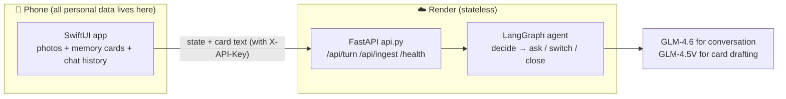

# 🕊️ Grounding Companion

A tool I built for myself: it turns the **happiest, most beautiful** photos in your camera roll
into a memory bank. When a flashback or panic attack hits, you open it, and it brings out one
good memory and — like a gentle friend — asks you **one soft question at a time**
(what do you see, what do you hear, where were you, what was the weather like, how did it feel…),
using real, concrete details to slowly bring you back to the present and to safety.

It doesn't offer "solutions". It just stays with you and guides you — the way a crisis-line
operator would — as you walk yourself out of the panic.

> A gentle reminder: this is a small helper meant to work *alongside* the support you already
> have (a therapist, a trusted person on the hardest days, a crisis hotline), not to replace it.
> The app has a "contact someone you trust" entry — put your own person there.

---

## What's in this repository

```
grounding-companion/
├── backend/          # Python backend: agent brain (LangGraph) + FastAPI shell + local Streamlit app
│   ├── grounding_graph.py   # agent loop: read the emotion → decide to ask / switch photo / close
│   ├── api.py               # FastAPI (for the iOS app; stateless, API-key gated)
│   ├── app.py               # local Streamlit app (Companion / Memory Bank / My Archive)
│   ├── vision_ingest.py     # photo → draft memory card (the only place that ever sees pixels)
│   ├── llm_config.py        # model config (OpenAI-compatible; switch providers in one place)
│   ├── memory_store.py      # local storage (Streamlit mode only)
│   ├── eval_log.py          # outcome eval: blind A/B vs. a random baseline + recovery archive
│   ├── render.yaml          # Render deploy blueprint (the stateless service)
│   └── data/                # personal data (photos / cards / session logs) — gitignored, never committed
├── ios/              # native SwiftUI app (installed via TestFlight)
│   ├── Sources/             # all Swift source
│   ├── project.yml          # XcodeGen project definition (the .xcodeproj is generated, not committed)
│   └── Config.example.xcconfig   # template for signing / backend URL / key (real values never committed)
├── docs/             # PRD, wall-log, and the shelved web-version roadmap
└── .github/workflows/ping.yml   # pings /health every 5 min so Render's free tier never sleeps
```

## Privacy red lines (the foundation of the whole design)

1. **Photos never leave the phone.** Memory cards (title / scene / senses / emotion — text only)
   live on the phone. The photos live on the phone.
2. **The agent only ever reads the card text. It never sees photo pixels.** This is exactly why
   the photos don't need to be in the cloud at all. The single exception is card creation:
   `/api/ingest` lets a vision model look at a photo once to draft the card — the photo passes
   through memory and is never written to disk.
3. **The backend is stateless.** Each turn, the phone sends up "the conversation state + the card
   text"; the server runs one agent step, replies, and stores nothing. Even if the server were
   compromised, there would be nothing to take.
4. **API-key gate.** Every `/api/turn` call spends money on an LLM, and the raw words of a panic
   episode pass through it — so nothing moves without the key (`X-API-Key` header,
   constant-time comparison to avoid timing side channels).

## Architecture



Each turn of the agent loop (`grounding_graph.py`):

- **decide**: reads what she just said and the emotional trail, then autonomously chooses —
  keep gently asking (compose), switch to another photo (switch), or call a tool (run_tool);
- **compose**: generates the reply, then post-processes it programmatically — **truncate at the
  first question mark, strip narration**. The core interaction principle:
  **the AI should talk less and get her talking, not talk for her.** The healing happens the
  moment she opens her mouth and recalls the warm details herself; the instant the AI describes
  the photo, it has stolen the remembering from her;
- the opening photo pick (`pick_memory`) selects by **predicted emotional-regulation efficacy**,
  not semantic similarity, and avoids recently shown photos (to prevent desensitization).

## Does it actually work? Measure honestly (`eval_log.py`)

Every panic session logs a 0-10 rating before and after. **Blind A/B**: sometimes the agent runs,
sometimes a dumb no-LLM baseline runs, and the user doesn't know which. Only the margin by which
the agent arm beats the baseline counts as real effect (regression to the mean is subtracted out).
With small n the numbers are noise, and `analyze()` says so plainly. These logs double as a
personal recovery archive and never leave the machine.

## Running locally

### Backend (FastAPI, what the iOS app talks to)

```bash
cd backend
python3 -m venv .venv && source .venv/bin/activate
pip install -r requirements-server.txt
cp .env.example .env        # fill in OPENAI_API_KEY etc. (see comments); set REQUIRE_API_KEY=0 for local dev
uvicorn api:app --reload --port 8000
curl http://localhost:8000/health
```

### Local Streamlit app (full functionality without installing the iOS app)

```bash
cd backend
pip install -r requirements.txt
streamlit run app.py        # three modes: 🕊️ Companion / 📷 Memory Bank / 📊 My Archive
```

The sidebar has a "give feedback on this app" box — jot things down as you go; they accumulate
in `feedback.jsonl` for batch processing later.

### Model providers

Everything goes through an OpenAI-compatible interface, so switching providers means changing
three lines in `.env` (`OPENAI_API_KEY` / `OPENAI_BASE_URL` / `GROUNDING_MODEL`).
`.env.example` ships three ready-made blocks: OpenAI / z.ai GLM / local Ollama.
⚠️ GLM gotcha: z.ai enables "deep thinking" by default, which turns a one-line reply into
20-35 seconds; `DISABLE_THINKING=1` brings it down to ~2s (leave thinking on for the vision
ingest path).

## Building the iOS app

```bash
cd ios
cp Config.example.xcconfig Config.xcconfig   # fill in Team ID / bundle id / backend URL / API key
xcodegen generate                            # generates the .xcodeproj from project.yml
open Grounding.xcodeproj                     # or go xcodebuild archive + ASC API to TestFlight
```

`Config.xcconfig` and `exportOptions.plist` contain signing info and keys — they never enter
the repo (`.example` templates are provided).

## Deployment & branches (important)

- **`main`** = the current design: stateless backend + iOS app. Matches the Render blueprint
  `backend/render.yaml` (service name `grounding-agent`, `rootDir: backend`).
- **`legacy-photo-backend`** = the old **stateful** backend (photos bundled alongside the
  code, no API-key gate). The live legacy service and the old TestFlight build still
  depend on it.
  **Do not delete this branch or that service until the new app is installed and the photos
  have migrated back to the phone.**
- When the old app upgrades to the new one, first launch uses `GROUNDING_MIGRATE_BASE` to pull
  the photos and cards back from the old backend onto the phone; after that the old service can
  be retired.
- `.github/workflows/ping.yml` hits `/health` every 5 minutes so the free tier never sleeps
  (cold start is 30-60s — waiting a minute during a panic attack is unacceptable). The backend
  URL lives in the repo secret `BACKEND_URL`.

## docs/

- [`PRD.md`](docs/PRD.md) — founding design: goal ordering (personally useful > learn agents >
  probe the market gap), red lines, layered build plan
- [`wall-log.md`](docs/wall-log.md) — the wall log: one line every time off-the-shelf agent
  infra can't do what this agent needs; clustering the `[GAP]` entries surfaces candidate
  "X for agents" directions
- [`roadmap-web-shelved.md`](docs/roadmap-web-shelved.md) — the multi-user web version roadmap
  (shelved, kept for the record)
